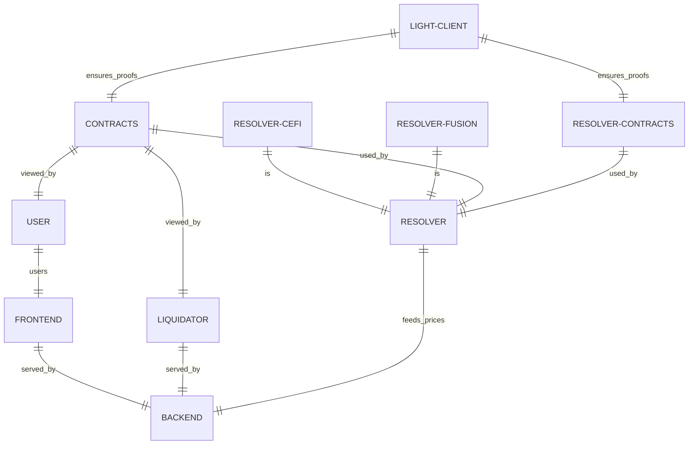

# [⚡ Kinetex Flash](https://dp.kinetex.io)
# Built on ETHGlobal Lisbon Hackathon

[ Kinetex Flash](https://dp.kinetex.io) is a decentralized application (dApp) designed to provide users with a secure, efficient, and seamless method of swapping digital assets across different blockchains. Leveraging cutting-edge technology and advanced cryptographic techniques, Kinetex ensures that users can quickly and safely transfer their tokens from one chain to another.

## Key Features

Kinetex stands out from the crowd, offering several unique features:

### Instant Transfers

One of the significant advantages of Kinetex is the ability to provide instant transfers. Traditional cross-chain swaps can be time-consuming, especially when bridges are involved. Kinetex Flash enables users to send their tokens instantly to the recipient blockchain, ensuring a smooth and rapid swapping experience.

### Collateral-Backed Security

Security is at the forefront of Kinetex Flash. To ensure that every swap is secure, market makers are required to lock collateral for every order they fulfill. This collateral acts as a guarantee for the user, ensuring that their assets are safe even if the market maker fails to send the swapped tokens. In the event of any discrepancy, the user can claim a refund from this collateral, ensuring their assets are never lost.

### Zero-Knowledge Proofs

In Kinetex Flash, ZK proofs are used to verify token transfers between different chains. If a market maker fails to send tokens to a user, a ZK proof of the failed trade is constructed. This proof can be used to initiate a refund from the locked collateral, ensuring the security and integrity of every transaction.

## Project structure

Kienetex Flash is powered by the following components:

### Frontend

The client dApp application that allows traders to utilize the protocol. Fetches the best price for a given trade and helps form the order.

[Jump to the code](https://github.com/KinetexNetwork/ethglobal-lisbon-zk-resolving/tree/main/flash-frontend)

### Backend

The backend service that allows to communicate with the market makers. Receives price levels from the market makers, receives quotes from the client and helps lock the order.

[Jump to the code](https://github.com/KinetexNetwork/ethglobal-lisbon-zk-resolving/tree/main/flash-backend)

### Resolver

The market maker service that helps feed price levels, receive locked orders and fill them. There are two versions of the resolver:

-   `resolver-cefi`

    Reference resolver implementation for a market maker that works with ceFi prices. Our example uses the Binance order book.

    [Jump to the code](https://github.com/KinetexNetwork/ethglobal-lisbon-zk-resolving/tree/main/resolver-cefi)

-   `resolver-defi-fusion`

    Reference resolver implementation for a market maker that works with ceFi prices. Our example uses the 1inch Fusion SDK.

    [Jump to the code](https://github.com/KinetexNetwork/ethglobal-lisbon-zk-resolving/tree/main/resolver-defi-fusion)

### Contracts

Solidity smart contracts for the Kinetex Flash Protocol.
The contracts are designed with modularity:

The `OrderReceiver` module is responsible for receiving orders from users. It verifies that the order has not expired and that the sender is the specified market maker.

The `OrderSender` module handles sending orders. It verifies that the order has not expired and that the sender is the specified user, then transfers the asset from the user to the market maker.

The `CollateralManager` module manages the collateral provided by the market makers. It handles depositing and withdrawing collateral, and is also responsible for resolving disputes and refunding users if a market maker fails to fulfill an order.

The `Verifier` module is responsible for verifying zk-SNARK proofs, which are used to resolve disputes and ensure the integrity of the system.

[Jump to the code](https://github.com/KinetexNetwork/ethglobal-lisbon-zk-resolving/tree/main/flash-contracts)

### Liquidator contracts

Solidity smart contracts to help liquidators fill unresolved disputes.

[Jump to the code](https://github.com/KinetexNetwork/ethglobal-lisbon-zk-resolving/tree/main/liquidator-contracts)

### ZK Lightclient

An on-chain light client implemantation that allows traders, liquidators and market makers to verify validity of their transfers. The validity and gas efficiency of this data is backed by zero-knowledge cryptography. The ZK service consists of the following parts:

#### Contracts

Solidity smart contracts for the on-chain ZK-based light client. They allow to track current state and prove that events happened in the Kinetex Flash protocol.

[Jump to the code](https://github.com/KinetexNetwork/ethglobal-lisbon-zk-resolving/tree/main/zk-lightclient)

#### Curcuits

Our system uses modified Telepathy ZK-Snark circuits built in the Circom language. These circuits are designed to prove that the current BeaconState in the light client is valid.

[Jump to the code](https://github.com/KinetexNetwork/ethglobal-lisbon-zk-resolving/tree/main/zk-lightclient)

#### Light client update service

To update the light client, several steps and calculations are needed. This service automates the process of maintaining the state of light client.

[Jump to the code](https://github.com/KinetexNetwork/ethglobal-lisbon-zk-resolving/tree/main/zk-lightclient/lightclient-observer)
